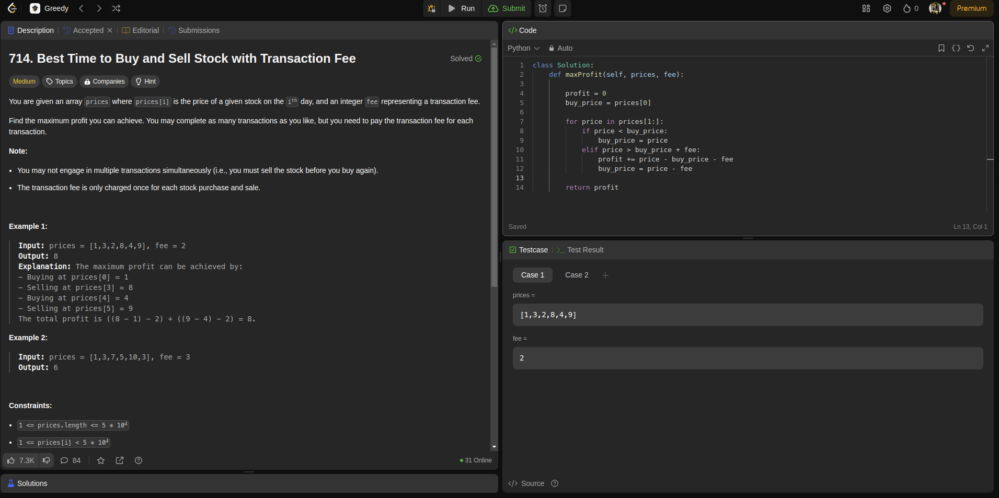
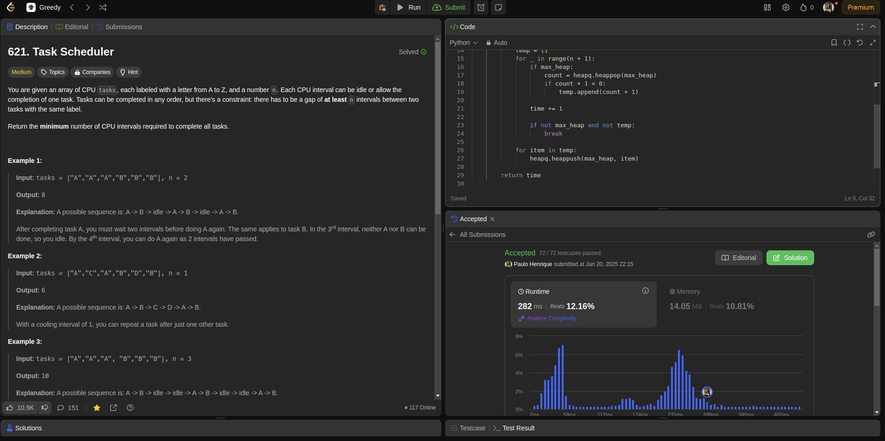

Temas:
 - Algoritmos ambiciosos
 
# Ambiciosos_LeetCode

**Número da Lista**: 11<br>
**Conteúdo da Disciplina**: Greed<br>

## Alunos
|Matrícula | Aluno |
| -- | -- |
| 19/0094257  |  Paulo Henrique de O. Rezende |
| 23/2022952  |  Leonardo de Souza Takehana |

## Sobre 
O projeto é contemplado por resolver 4 questões da plataforma LeetCode, sendo 2 dífíceis e 2 médio. A definição de médio, fácil e difícil é concebida pela própria plataforma.

Para os exercícios serem realizados, usamos o algorito de Interval Scheduling, Interval Partitioning, e Heap Priority.

## Screenshots
Questão: [Médio - 714. Best Time to Buy and Sell Stock with Transaction Fee](https://leetcode.com/problems/best-time-to-buy-and-sell-stock-with-transaction-fee/description/?envType=problem-list-v2&envId=greedy)

Questão: [Médio - 621. Find Edges in Shortest Paths](https://leetcode.com/problems/task-scheduler/description/?envType=problem-list-v2&envId=greedy)


## Instalação 
**Linguagem**: python<br>
**Framework**: Não será preciso<br>
Instalar uma versão lastest stable do python desde de que seja > 3.11.  

## Uso 
Para rodar este projeto, basta entrar na raiz do projeto e executar o arquivo referente a questão que se deseja avaliar, por exemplo:
```
python3 1489.FindCriticalAndPseudo-CriticalEdgesInMinimumSpanningTree.py
```

## Outros
Desconsiderar a função </br>main()<br> dos arquivos .py ao tentar submeter ao leetcode. Esta função foi implementada apenas com o intuito de testar casos base.

## Vídeo
https://youtu.be/y7-J1r72nwU
